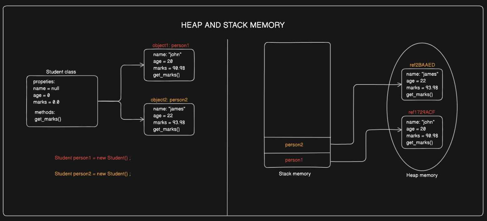

Let’s talk about memory management in Java. It’s one of those things that makes Java super cool because it handles a lot of stuff for you behind the scenes. No need to worry about manually freeing up memory like in some other languages (looking at you, C++!). When JVM starts up, it gets a chunk of memory from the underlying OS and uses it run your Java program. 

## The Basics of Java Memory

When you write a Java program, the memory it uses is divided into two main parts:

1. Stack Memory

2. Heap Memory

**Stack Memory**

Think of the stack as a short-term memory for your program. It’s where things like method calls and local variables live. Each thread in your program gets its own stack, and once a method is done doing its thing, the memory it was using on the stack gets deleted.! 

**Heap Memory**

Now, the heap is like a big storage area where Java keeps all the stuff that needs to stick around for a while, like objects and class stuff. It’s shared by all the threads in your program.


## Understanding Heap and Stack Memory in Java

This image illustrates how **Heap and Stack Memory** work in Java, using a `Student` class as an example. Let's break it down in simple terms:



---

## Left Side: Object Creation (Stack)

1. **Student Class**:
   - Defines properties:
     - `name` (default: `null`)
     - `age` (default: `0`)
     - `marks` (default: `0.0`)
   - Includes a method `get_marks()` to retrieve the marks.

2. **Objects `person1` and `person2`**:
   - Two objects are created with the following code:
     ```java
     Student person1 = new Student();
     Student person2 = new Student();
     ```
   - Each object has its own unique data:
     - **`person1`**:
       - `name = "John"`
       - `age = 20`
       - `marks = 90.98`
     - **`person2`**:
       - `name = "James"`
       - `age = 22`
       - `marks = 93.98`

---

## Right Side: Actual Object (Heap)

### 1. Stack Memory:
- **What it does**:
  - Stores references to the objects in the heap.
  - Contains the variables `person1` and `person2`.
- **How it works**:
  - These variables point to the actual objects stored in the heap memory.

### 2. Heap Memory:
- **What it does**:
  - Stores the actual objects and their data (e.g., `name`, `age`, `marks`) as well as the method `get_marks()`.
- **How it works**:
  - Each object is stored at a unique memory location or reference:
    - `ref1729ACF` (for `person1`).
    - `ref2BAAED` (for `person2`).
  - These references are used by the variables in the stack to access the objects in the heap.

---

## How It All Connects:
- The **stack memory** contains variable names (`person1` and `person2`) that act as **pointers** to objects in the heap.
- The **heap memory** holds the actual object data (`John's` and `James's` details).
- This separation allows Java to efficiently manage memory:
  - The stack is for short-term storage (method-specific variables).
  - The heap is for long-term storage (objects and their data).

  The heap is further split into three sections:

1. Young Generation: Where all the new objects hang out.
2. Old Generation (Tenured Generation): For objects that’ve been around the block a few times.
3. Metaspace: For the metadata about your classes. (Fun fact: Metaspace replaced PermGen in Java 8!)

---

## Garbage Collection: Java’s Cleanup Crew

One of the coolest things about Java is garbage collection. The garbage collector (GC) goes through the heap and gets rid of objects that your program doesn’t need anymore. If something in your heap memory (where all objects live) is not being referenced by anything and are basically just idle in the heap, gets removed by Garbage Collector. 

The GC checks which objects are still being used and which ones aren’t. If something isn’t being used, it’s marked as garbage and cleaned up. This frees up space in the heap for new stuff.

## Different GC Methods

Java has a few different ways to handle garbage collection:

1. Mark and Sweep: Marks objects that are still in use and sweeps away the rest.

2. Generational GC: Splits objects into young and old generations to speed things up.

3. G1 Garbage Collector: Great for apps with big heaps. It focuses on cleaning up the areas with the most garbage first.

4. Z Garbage Collector (ZGC): Super fast and handles massive heaps with almost no pauses. Fancy!

## Can Memory Leaks Happen in Java?

Yup, even with all this automation, memory leaks can sneak in. They happen when objects stick around in memory even though you’re done with them. Some common culprits are:

- Static variables holding onto objects they shouldn’t.

- Listeners or callbacks that aren’t removed properly.

- Collections (like ArrayList) that aren’t cleared.

## How to Avoid Memory Leaks

- Use tools like VisualVM or Eclipse Memory Analyzer to keep an eye on memory usage.

- Set unused object references to null.

- Use WeakReference or SoftReference for things like caches.

## Quick Tips for Better Memory Management

1. Reuse Objects: Why make new ones if you can reuse existing ones? Saves time and memory.

2. Pick the Right Data Structures: Don’t use a sledgehammer when you need a scalpel.

3. Watch Your Loops: Nested loops or deep recursion can gobble up stack memory fast.

4. Clean Up After Yourself: Close your streams, connections, and anything else you open.

5. Profile Your App: Use tools to see what’s eating up memory and fix it.

## Wrapping It Up

1. **Stack Memory**:
   - Used for method-specific storage (e.g., variable references).
   - Automatically cleared after method execution.

2. **Heap Memory**:
   - Stores objects and their data.
   - Shared among all threads in a program.


It’s mostly hands-off, thanks to the JVM and garbage collector, but knowing how it works can help you write better, faster, and more efficient code.